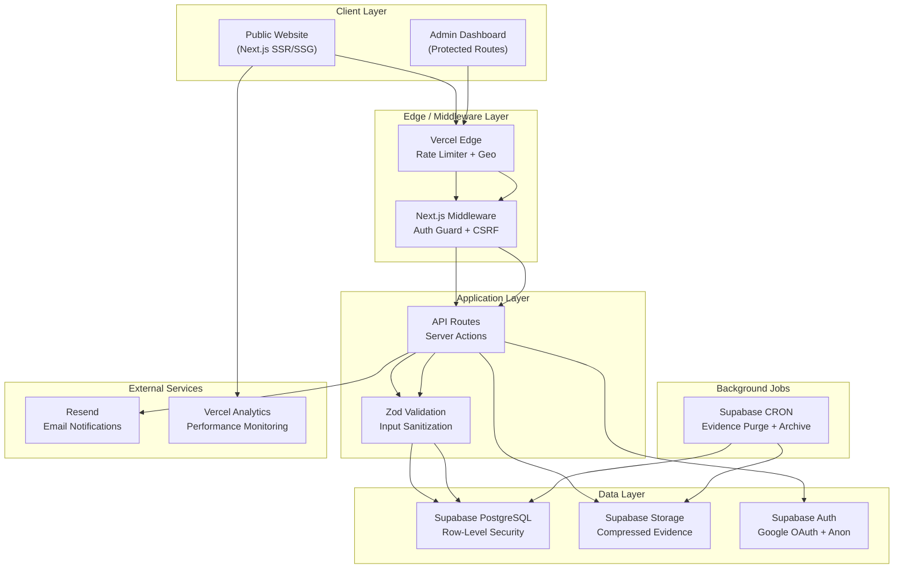
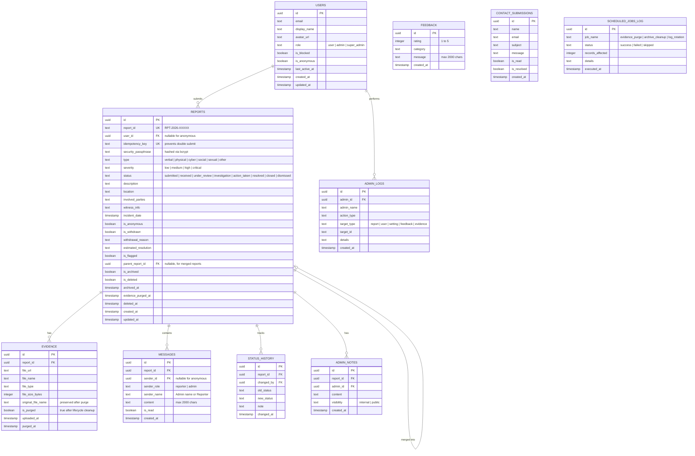
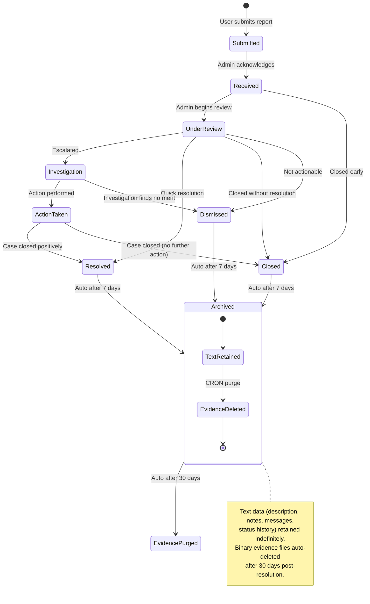
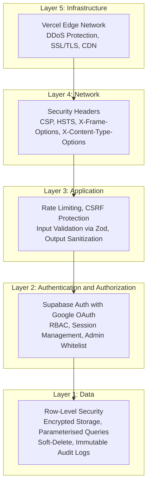
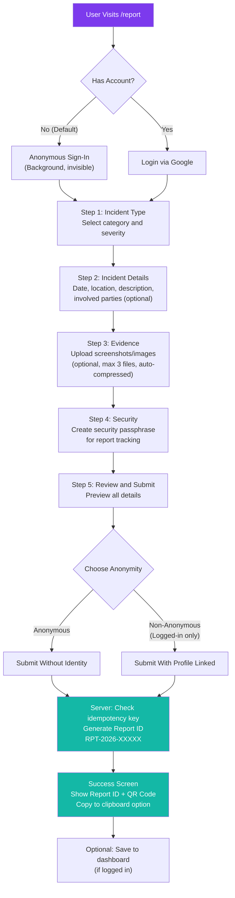
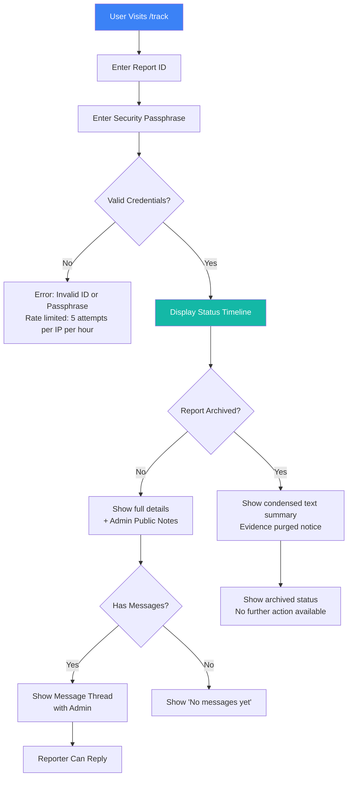
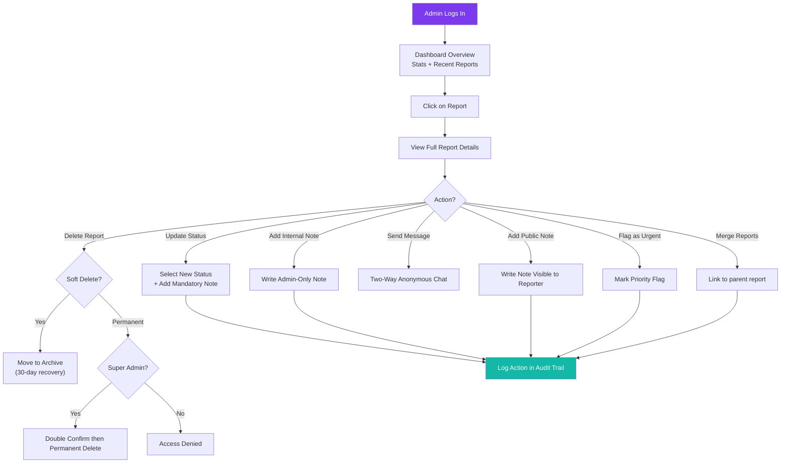
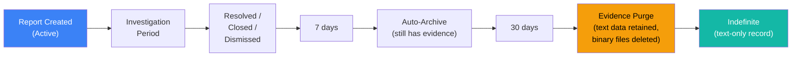
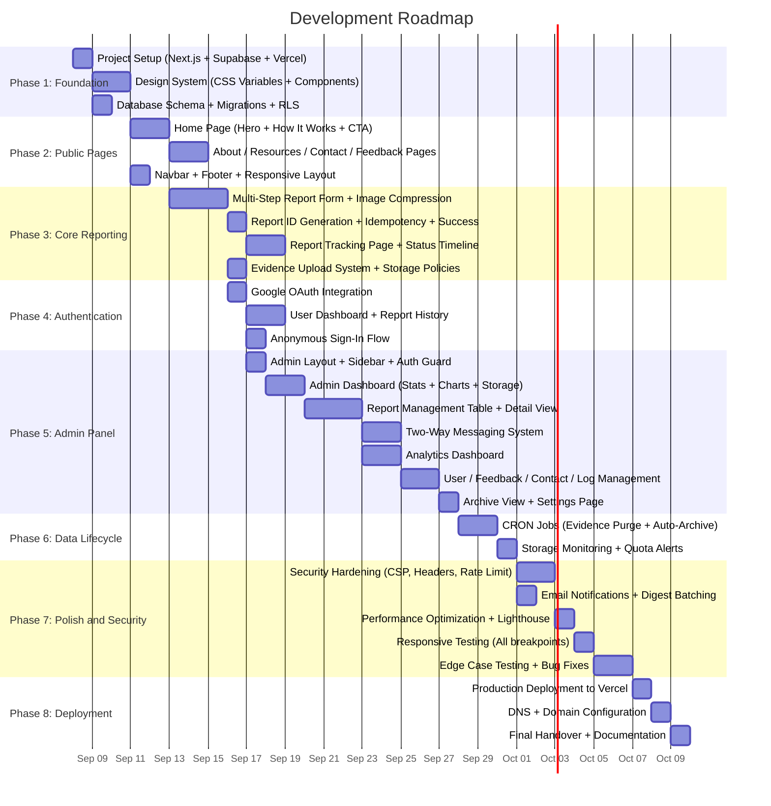

# Anti-Bullying Reporting Platform: Complete Project Blueprint

> **Project:** Anonymous Bullying Reporting & Case Management System  
> **Client Delivery:** Premium, production-grade web application  
> **Status:** Final Plan, Awaiting Approval  

---

## 1. Executive Summary

A secure, anonymous bullying-reporting platform that empowers individuals to report incidents without fear of retaliation. The system provides a robust administrative dashboard for case management, analytics, and resolution tracking, all wrapped in a world-class, premium visual experience.

**Key Differentiators:**
- Zero-friction anonymous reporting (no account required)
- Unique Report ID with real-time status tracking
- Two-way anonymous communication between admin and reporter
- Enterprise-grade security (RLS, RBAC, rate-limiting, CSP)
- Fully responsive across all devices (mobile, tablet, desktop, ultrawide)
- Intelligent data lifecycle management with automated storage optimization
- Premium dark-mode glassmorphism design with micro-animations

---

## 2. Technology Architecture

### 2.1 Tech Stack

| Layer | Technology | Purpose |
|-------|-----------|---------|
| **Frontend** | Next.js 14+ (App Router) | Server-side rendering, SEO, routing |
| **Styling** | Vanilla CSS + CSS Variables | Design system, animations, responsiveness |
| **Backend** | Next.js API Routes + Server Actions | Business logic, server-side validation |
| **Database** | Supabase (PostgreSQL) | Data storage, Row-Level Security, real-time subscriptions |
| **Authentication** | Supabase Auth (Google OAuth + Anonymous Sign-In) | User authentication |
| **File Storage** | Supabase Storage | Evidence uploads (images, screenshots) |
| **Deployment** | Vercel | Hosting, edge functions, CDN, SSL |
| **Email** | Supabase Edge Functions + Resend | Admin notifications, status update alerts |
| **Validation** | Zod | Schema-based input validation |
| **Animations** | Framer Motion | Premium micro-interactions |
| **Icons** | Lucide React | Consistent, modern iconography |
| **Fonts** | Google Fonts (Inter / Plus Jakarta Sans) | Premium typography |
| **Image Processing** | browser-image-compression | Client-side resize and WebP conversion before upload |

### 2.2 High-Level Architecture



---

## 3. Site Structure & Navigation

### 3.1 Sitemap

```mermaid
graph TD
    ROOT["/ (Home)"]

    ROOT --> REPORT["/report (Submit Report)"]
    ROOT --> TRACK["/track (Track Report)"]
    ROOT --> RESOURCES["/resources (Help & Resources)"]
    ROOT --> ABOUT["/about (About Us)"]
    ROOT --> CONTACT["/contact (Contact Us)"]
    ROOT --> FEEDBACK["/feedback (Feedback Form)"]
    ROOT --> LOGIN["/login (User Login)"]
    ROOT --> ADMIN_LOGIN["/admin/login (Admin Login)"]

    LOGIN --> DASHBOARD["/dashboard (User Dashboard)"]
    DASHBOARD --> MY_REPORTS["/dashboard/reports (My Reports)"]
    DASHBOARD --> PROFILE["/dashboard/profile (Profile)"]

    ADMIN_LOGIN --> ADMIN["/admin (Admin Dashboard)"]
    ADMIN --> ADMIN_REPORTS["/admin/reports (All Reports)"]
    ADMIN --> ADMIN_DETAIL["/admin/reports/:id (Report Detail)"]
    ADMIN --> ADMIN_ARCHIVE["/admin/archive (Archived Reports)"]
    ADMIN --> ADMIN_ANALYTICS["/admin/analytics (Analytics)"]
    ADMIN --> ADMIN_USERS["/admin/users (User Management)"]
    ADMIN --> ADMIN_FEEDBACK["/admin/feedback (View Feedback)"]
    ADMIN --> ADMIN_CONTACTS["/admin/contacts (Contact Submissions)"]
    ADMIN --> ADMIN_SETTINGS["/admin/settings (Settings)"]
    ADMIN --> ADMIN_LOGS["/admin/logs (Activity Logs)"]
```



### 3.2 Page-by-Page Breakdown

| # | Page | Access Level | Description |
|---|------|-------------|-------------|
| 1 | **Home** `/` | Public | Hero section, how-it-works, statistics counter, CTA to report |
| 2 | **Submit Report** `/report` | Public | Multi-step report form with anonymous or authenticated submission |
| 3 | **Track Report** `/track` | Public | Enter Report ID to view status timeline |
| 4 | **Resources** `/resources` | Public | Helpline numbers, anti-bullying guides, educational content |
| 5 | **About Us** `/about` | Public | Mission, team, vision (name/logo TBA) |
| 6 | **Contact Us** `/contact` | Public | Contact form with admin phone numbers, social links |
| 7 | **Feedback** `/feedback` | Public | Anonymous feedback form about the platform |
| 8 | **Login** `/login` | Public | Google OAuth login for users who want to track reports |
| 9 | **User Dashboard** `/dashboard` | Authenticated User | View submitted reports, status updates, profile management |
| 10 | **Admin Login** `/admin/login` | Admin Only | Admin-specific authentication |
| 11 | **Admin Dashboard** `/admin` | Admin Only | Overview cards, recent reports, quick actions |
| 12 | **Report Management** `/admin/reports` | Admin Only | Filterable, searchable report table with bulk actions |
| 13 | **Report Detail** `/admin/reports/:id` | Admin Only | Full report view, status updates, notes, communication log |
| 14 | **Archived Reports** `/admin/archive` | Admin Only | Resolved/closed cases (text-only, evidence purged) |
| 15 | **Analytics** `/admin/analytics` | Admin Only | Charts, trends, category breakdown, resolution metrics |
| 16 | **User Management** `/admin/users` | Admin Only | View registered users, manage roles |
| 17 | **Feedback Viewer** `/admin/feedback` | Admin Only | All submitted feedback in sortable table |
| 18 | **Contact Submissions** `/admin/contacts` | Admin Only | All contact form submissions |
| 19 | **Activity Logs** `/admin/logs` | Admin Only | Timestamped audit trail of all admin actions |
| 20 | **Settings** `/admin/settings` | Admin Only | Platform configuration, notification preferences |

---

## 4. User Features (Complete Breakdown)

### 4.1 Anonymous Reporting (No Account Required)

| Feature | Details |
|---------|---------|
| **Multi-Step Report Form** | Guided wizard: Incident Type > Details > Evidence > Security > Review > Submit |
| **Report Types** | Verbal, Physical, Cyberbullying, Social/Relational, Sexual, Other |
| **Severity Levels** | Low, Medium, High, Critical (user selects) |
| **Incident Details** | Date/time of incident, location, description (mandatory, min 50 chars), involved parties (optional) |
| **Security Passphrase** | Min 6 characters, required for tracking. Hashed via bcrypt before storage; plaintext never persisted |
| **Evidence Upload** | Up to 3 files (images, screenshots), max 5MB each, auto-compressed to WebP before upload |
| **Witness Information** | Optional: names or details of witnesses |
| **Unique Report ID** | System generates a human-readable tracking code (e.g., `RPT-2026-A7X3K9`) with cryptographic uniqueness |
| **Report Receipt** | Success screen with Report ID, option to copy/download, QR code for quick access |
| **No IP Logging** | Reporter's IP address is never stored in the reports database |
| **Draft Saving** | Auto-save to localStorage so users don't lose progress on accidental close. Drafts expire after 7 days |
| **Idempotency Protection** | Each submission includes a unique client-generated key to prevent accidental double-submits |

### 4.2 Authenticated User Features (Google Login)

| Feature | Details |
|---------|---------|
| **Google OAuth Login** | One-click login via Google, no passwords to manage |
| **Personal Dashboard** | View all submitted reports with status, timestamps, and filters |
| **Report History** | Chronological list of all reports with search and filter |
| **Status Notifications** | Real-time badge/indicator when admin updates a report status |
| **Two-Way Messaging** | Anonymous chat thread with admin on each report (identity still protected if anonymous option was chosen) |
| **Edit/Withdraw Report** | User can request withdrawal of a report before admin marks it as "Under Review" |
| **Profile Management** | View/edit display name, notification preferences |
| **Data Export** | Download all personal reports as a JSON/CSV file |
| **Account Deletion** | User can request account deletion; orphans anonymous reports, deletes profile data |
| **Logout** | Secure session termination |

### 4.3 Report Tracking (Public, No Login Needed)

| Feature | Details |
|---------|---------|
| **Track by Report ID** | Enter the Report ID on the public tracking page |
| **Visual Status Timeline** | Animated vertical timeline showing all status transitions |
| **Status States** | `Submitted` > `Received` > `Under Review` > `Investigation` > `Action Taken` > `Resolved` / `Closed` / `Dismissed` |
| **Admin Notes (Public)** | Admin can attach public-facing notes visible to the reporter |
| **Estimated Resolution** | Optional field admins can set to communicate expected timelines |
| **Report Verification** | Requires Report ID + a security passphrase (set during submission) for added privacy |
| **Archived Report View** | Resolved reports show a condensed text-only summary (evidence auto-purged after 30 days) |
| **Archived Messaging** | Messaging is disabled on archived reports. Reporter sees "This case is closed. No further messages can be sent." |

### 4.4 Contact Us

| Feature | Details |
|---------|---------|
| **Contact Form** | Name, Email, Subject, Message with validation |
| **Admin Contact Info** | Display admin names and phone numbers (as provided) |
| **Social Media Links** | Placeholders for Instagram, Twitter/X, Facebook, LinkedIn (TBA) |
| **Map Embed** | Optional: Google Maps embed for physical address |
| **Auto-Response** | Success toast notification on form submission |
| **Rate Limiting** | Max 3 contact submissions per IP per hour to prevent spam |

### 4.5 Feedback Form

| Feature | Details |
|---------|---------|
| **Anonymous Feedback** | No login required |
| **Rating System** | 5-star rating for overall platform experience |
| **Category Tags** | UI/UX, Report Process, Speed, Communication, Other |
| **Free-Text Field** | Detailed comments (max 2000 characters) |
| **Submission Confirmation** | Animated success state |
| **Rate Limiting** | Max 5 feedback submissions per IP per day to prevent spam |

### 4.6 Resources Page

| Feature | Details |
|---------|---------|
| **Helpline Directory** | National/local anti-bullying helpline numbers |
| **Educational Content** | What is bullying, types, how to respond, bystander tips |
| **FAQ Accordion** | Common questions with smooth expand/collapse |
| **External Links** | Links to verified organizations and support groups |

---

## 5. Admin Panel Features (Complete Breakdown)

### 5.1 Admin Authentication & Access Control

| Feature | Details |
|---------|---------|
| **Admin Login** | Google OAuth restricted to whitelisted email addresses |
| **Role-Based Access** | `Super Admin` (full access) and `Admin` (case management only) |
| **Session Management** | Auto-logout after 30 minutes of inactivity |
| **Admin Whitelist** | Only pre-approved emails can access admin panel |
| **Activity Logging** | Every admin action is logged with timestamp, user, and action type |
| **Session Revalidation** | Middleware checks admin status on every request; if removed mid-session, immediate logout |

**Initial Admin List:**
| Name | Phone | Role |
|------|-------|------|
| Poorvi Aggarwal | 88827 03319 | Super Admin |
| Shreya Aggarwal | 8882962300 | Admin |
| Utkarsh Lohan | 85958 69833 | Admin |
| Rituraj Sharma | 8882904396 | Admin |

### 5.2 Dashboard Overview

| Feature | Details |
|---------|---------|
| **Stats Cards** | Total Reports, Pending, In Progress, Resolved, Dismissed (animated counters) |
| **Recent Reports** | Last 10 reports with quick-action buttons |
| **Trend Line Chart** | Reports over time (last 7/30/90 days) |
| **Category Pie Chart** | Distribution of report types |
| **Severity Heat Map** | Visual indicator of incoming severity levels |
| **Quick Actions** | Jump to: New Reports, Flagged, Overdue items |
| **Storage Usage Meter** | Visual indicator of current storage consumption (evidence files) |
| **Empty State** | If no reports exist yet, show an illustrated "all clear" message instead of blank tables |

### 5.3 Report Management

| Feature | Details |
|---------|---------|
| **Report Table** | Sortable columns: ID, Date, Type, Severity, Status, Last Updated |
| **Pagination** | Server-side cursor-based pagination, 20 items per page, with page navigation |
| **Advanced Filters** | By status, severity, type, date range, keyword search |
| **Bulk Actions** | Select multiple > Change status, Export, Archive |
| **Report Detail View** | Full incident details, evidence gallery, timeline, admin notes |
| **Status Update** | Dropdown to change status with mandatory note explaining the change |
| **Priority Flagging** | Flag reports as urgent with visual indicator |
| **Internal Notes** | Admin-only notes not visible to the reporter |
| **Public Notes** | Notes visible to the reporter on the tracking page |
| **Evidence Viewer** | In-panel image viewer with zoom, download option. Shows "Evidence purged" label for archived reports |
| **Delete Report** | Soft-delete with confirmation modal (moves to archive, recoverable for 30 days) |
| **Permanent Delete** | Super Admin only, irreversible deletion with double confirmation |
| **Export Report** | Export individual report as PDF |
| **Print Report** | Formatted print view for physical records |
| **Merge Reports** | Link duplicate/related reports under a parent report |

### 5.4 Two-Way Communication

| Feature | Details |
|---------|---------|
| **Message Thread** | Per-report chat-like interface between admin and reporter |
| **Admin Identity Shown** | Admin name visible to reporter in messages |
| **Reporter Stays Anonymous** | Reporter identity never exposed even in authenticated mode (if anonymous option was selected) |
| **Message Notifications** | Badge indicator for unread messages |
| **Message History** | Full scrollable history with timestamps |
| **Message Length Limit** | Max 2000 characters per message to prevent abuse |
| **Message Retention** | Messages for resolved cases are archived as text, not purged |

### 5.5 Analytics Dashboard

| Feature | Details |
|---------|---------|
| **Reports Over Time** | Line chart with daily/weekly/monthly granularity |
| **Category Breakdown** | Doughnut chart of bullying types |
| **Severity Distribution** | Bar chart of severity levels |
| **Resolution Rate** | Percentage of reports resolved vs. total |
| **Average Resolution Time** | How long from submission to resolution |
| **Peak Reporting Times** | Heat map of day-of-week x hour-of-day |
| **Status Funnel** | Visual funnel from Submitted to Resolved |
| **Date Range Picker** | Filter all analytics by custom date range |
| **Export Data** | CSV/PDF export of analytics data |
| **Empty State** | Friendly "Not enough data yet" placeholder when data is insufficient for charts |

### 5.6 User Management

| Feature | Details |
|---------|---------|
| **Registered Users List** | Email, display name, join date, report count (paginated) |
| **User Details** | View user's report history (without revealing anonymous reports) |
| **Block User** | Prevent spam accounts from submitting |
| **Admin Role Management** | Super Admin can promote/demote admins |
| **Last Active** | Timestamp of last login for each user |

### 5.7 Feedback & Contact Management

| Feature | Details |
|---------|---------|
| **Feedback Table** | Rating, category, message, date, sortable and filterable (paginated) |
| **Contact Submissions** | Name, email, subject, message, with read/unread status (paginated) |
| **Reply to Contact** | Open email client with pre-filled reply |
| **Mark as Read/Resolved** | Status tracking for contact submissions |
| **Bulk Delete** | Remove old feedback/contact entries in bulk |

### 5.8 Activity Logs & Audit Trail

| Feature | Details |
|---------|---------|
| **Action Log** | Every admin action logged: status changes, deletions, role changes, evidence purges |
| **Log Fields** | Timestamp, Admin Name, Action Type, Target (Report ID/User), Details |
| **Filterable** | By admin, action type, date range |
| **Non-Deletable** | Logs cannot be deleted or modified, integrity guaranteed |
| **Retention** | Logs retained for 1 year, then auto-archived to compressed JSON export |
| **Pagination** | Server-side pagination with infinite scroll |

### 5.9 Settings

| Feature | Details |
|---------|---------|
| **Notification Preferences** | Toggle email notifications for new reports, status changes |
| **Platform Config** | Site name (TBA), logo upload, social media links |
| **Report Categories** | Add/edit/remove bullying categories |
| **Status Workflow** | Customize available statuses and transitions |
| **Evidence Retention** | Configure retention period for evidence files after resolution (default: 30 days) |
| **Maintenance Mode** | Toggle site into maintenance with custom message |
| **Storage Dashboard** | View current database and file storage consumption |

---

## 6. Database Schema

### 6.1 Entity-Relationship Diagram



### 6.2 Key Indexes

| Table | Column(s) | Purpose |
|-------|-----------|---------|
| `reports` | `report_id` (UNIQUE) | Fast lookup by tracking ID |
| `reports` | `idempotency_key` (UNIQUE) | Prevent duplicate submissions |
| `reports` | `user_id` | RLS policy performance |
| `reports` | `status, is_deleted, is_archived` | Composite filter for active reports |
| `reports` | `created_at` | Sort by date |
| `reports` | `parent_report_id` | Merged report lookup |
| `evidence` | `report_id, is_purged` | Evidence retrieval with purge awareness |
| `messages` | `report_id, created_at` | Message thread ordering |
| `status_history` | `report_id, changed_at` | Timeline rendering |
| `admin_logs` | `created_at` | Log browsing |
| `admin_logs` | `action_type` | Filter by action type |

---

## 7. Data Lifecycle & Storage Optimization

### 7.1 Report Lifecycle State Machine



### 7.2 Evidence Lifecycle

| Phase | Timeframe | What Happens |
|-------|-----------|-------------|
| **Active** | Report status is NOT resolved/closed/dismissed | Evidence files are stored and fully accessible to admins |
| **Grace Period** | 0 to 30 days after resolution | Evidence still accessible. Admin can manually download/export before purge |
| **Purge** | 30 days after resolution (CRON job) | Binary files deleted from Supabase Storage. `evidence` row kept with `is_purged = true`, preserving metadata (filename, type, size, upload date) |
| **Indefinite** | Forever | Text data (report description, notes, messages, status history, admin logs) retained permanently |

### 7.3 Image Compression Pipeline

```
User selects image
    |
    v
Client-side processing (browser-image-compression):
    1. Resize: max dimension 1920px (preserves aspect ratio)
    2. Convert: output format WebP (85% quality)
    3. Cap: reject if still > 5MB after compression
    |
    v
Upload compressed WebP to Supabase Storage
    |
    v
Store metadata in `evidence` table (original filename, compressed size)
```

**Storage savings estimate:** Average phone photo (4-8MB JPEG) compresses to 200-500KB WebP. This is a 10-15x reduction.

### 7.4 Automated Cleanup Jobs (Supabase CRON via pg_cron)

| Job | Schedule | Action |
|-----|----------|--------|
| **Evidence Purge** | Daily at 02:00 UTC | Find reports where `status IN (resolved, closed, dismissed)` AND `archived_at < NOW() - 30 days` AND `evidence_purged_at IS NULL`. Delete storage files, set `evidence.is_purged = true`, set `reports.evidence_purged_at = NOW()`. Log to `scheduled_jobs_log` |
| **Soft-Delete Cleanup** | Weekly (Sunday 03:00 UTC) | Permanently delete reports where `is_deleted = true` AND `deleted_at < NOW() - 30 days`. Remove all associated evidence, messages, notes, and status history. Log results |
| **Auto-Archive** | Daily at 01:00 UTC | Move reports with terminal status (resolved/closed/dismissed) older than 7 days to `is_archived = true` |
| **Stale Draft Notification** | Weekly | Identify reports in `submitted` status for > 14 days with no admin action; flag them in dashboard |
| **Log Rotation** | Monthly (1st, 04:00 UTC) | Archive admin logs older than 12 months to compressed JSON export, then delete originals |
| **Anonymous Session Cleanup** | Weekly | Remove orphaned anonymous auth sessions older than 90 days with no associated reports |

### 7.5 Storage Budget Awareness

| Resource | Budget-Conscious Approach |
|----------|--------------------------|
| **Database rows** | Cursor-based pagination on all queries (no OFFSET). Composite indexes on frequently filtered columns. `EXPLAIN ANALYZE` on critical queries |
| **File storage** | Auto-purge lifecycle (Section 7.2). Client-side compression before upload. Max 3 files per report, 5MB cap each (post-compression) |
| **Bandwidth** | Next.js Image Optimization serves responsive sizes via `<Image>` component. Static pages use ISR with 1-hour revalidation. CDN caching via Vercel edge |
| **Realtime connections** | Subscribe only on pages that need it (admin detail view, user dashboard). Unsubscribe on unmount. Single channel per report, not per-table |
| **Auth sessions** | Anonymous sessions auto-cleaned after 90 days. Session tokens stored in HttpOnly cookies (no localStorage bloat) |
| **Email volume** | Batch notifications: if 5+ reports arrive within 10 minutes, send one digest email instead of 5 separate ones. Weekly analytics digest is a single email, not per-metric |

### 7.6 Data Retention Policy

| Data Type | Retention Period | After Expiry |
|-----------|-----------------|-------------|
| **Report text data** | Indefinite | Kept permanently for historical records and analytics |
| **Evidence files** | 30 days after resolution | Binary files deleted; metadata row preserved |
| **Messages** | Indefinite | Text retained as part of case record |
| **Status history** | Indefinite | Preserved for audit and analytics |
| **Admin logs** | 12 months active, then archived | Exported as compressed JSON, then originals deleted |
| **Feedback** | Indefinite | Lightweight text data, minimal storage cost |
| **Contact submissions** | 6 months after marked resolved | Auto-deleted by CRON |
| **Soft-deleted reports** | 30 days | Permanently deleted with all associated data |
| **Anonymous auth sessions** | 90 days (no reports) | Cleaned by CRON |
| **localStorage drafts** | 7 days | Client-side TTL, auto-cleared |

---

## 8. Resource-Efficient Architecture

> This section documents the engineering principles used to ensure the platform operates with maximum efficiency at any scale, from initial launch to high-traffic growth, without requiring code-level changes when scaling resources.

### 8.1 Stateless, Horizontally Scalable Design

- All server-side logic is stateless (no in-memory sessions, no server-local caches)
- Authentication state is managed via signed JWTs and HTTP-only cookies
- Any Vercel serverless function instance can handle any request independently
- Database connection pooling via Supavisor (Supabase's built-in connection pooler) prevents connection exhaustion under concurrent load

### 8.2 Edge-First Computation

- Rate limiting and auth guard checks run in Vercel Edge Middleware (V8 isolates, sub-millisecond cold start)
- Static and ISR pages are served from the CDN edge node closest to the user
- API routes use Vercel Serverless Functions with automatic regional deployment

### 8.3 Lazy Evaluation & Minimal Data Transfer

- All list views use server-side cursor-based pagination (never `SELECT *` without `LIMIT`)
- Admin dashboard stats computed via PostgreSQL aggregate queries (COUNT, AVG) rather than fetching all rows to the client
- Analytics charts use database-level GROUP BY with date truncation, not client-side data processing
- Evidence images are lazy-loaded and served as optimized WebP thumbnails
- Supabase Realtime subscriptions are scoped to individual report channels, not table-wide listeners

### 8.4 Intelligent Caching Strategy

| Content Type | Cache Strategy | TTL |
|-------------|---------------|-----|
| Home / About / Resources | Static Generation (SSG) | Revalidate every 1 hour (ISR) |
| Report Form | Client-side render (CSR) | No cache (dynamic) |
| Tracking Page | Server-side render (SSR) | No cache (real-time data) |
| Admin Dashboard | SSR with stale-while-revalidate | 30 seconds |
| Analytics Charts | SSR with ISR | 5 minutes |
| Static assets (CSS, JS, fonts) | Immutable CDN cache | 1 year (hash-busted filenames) |

### 8.5 Database Query Optimization

- All RLS policy auth functions wrapped in `(SELECT auth.uid())` subquery to prevent per-row re-evaluation
- Composite indexes on `(status, is_deleted, is_archived)` for the most common admin query pattern
- `EXPLAIN ANALYZE` run on all critical queries during development to verify index usage
- Partial indexes where applicable (e.g., index only non-deleted, non-archived reports)
- Connection pooling mode: `transaction` (returns connection to pool after each query)

### 8.6 Email Efficiency

- Digest batching: multiple events within a 10-minute window consolidated into a single notification
- Weekly analytics sent as one summary email, not per-metric
- Email templates are static HTML (no server-side rendering per send)
- Bounce handling: failed emails logged but not retried endlessly (max 2 retries)

### 8.7 Graceful Degradation

| Failure Scenario | Behavior |
|-----------------|----------|
| Email service down | Reports still accepted; admin notifications queued; toast shown "Notification delivery delayed" |
| Supabase Realtime unavailable | Dashboard falls back to polling (30-second interval) |
| Google OAuth temporarily down | Login page shows "Authentication service temporarily unavailable" with retry button |
| Storage quota reached | New uploads blocked with clear message "Evidence upload temporarily unavailable"; admin alerted via dashboard banner |
| Database connection pool exhausted | Requests queue with 5-second timeout; 503 returned with "Please try again in a moment" |

---

## 9. Security Architecture

### 9.1 Security Pyramid



### 9.2 Attack Mitigation Matrix

| Attack Vector | Mitigation | Implementation |
|--------------|------------|----------------|
| **SQL Injection** | Parameterised queries | Supabase client uses parameterised queries by default; no raw SQL on client |
| **XSS** | CSP headers + React auto-escaping + DOMPurify | `next.config.js` CSP policy; sanitize any user-rendered HTML |
| **CSRF** | Server Actions (POST-only) + SameSite cookies | Next.js Server Actions; `SameSite=Strict` on auth cookies |
| **Broken Authentication** | Google OAuth only (no password storage) | Supabase Auth with Google provider; no custom auth logic |
| **Broken Access Control** | RLS + Middleware guards + RBAC | RLS policies on every table; middleware checks role before admin routes |
| **Rate Limiting** | Edge middleware throttling | IP-based rate limit: 30 req/min general, 5/min for submissions, 5/hour for tracking attempts |
| **File Upload Abuse** | Type validation + size limits + client-side compression | Accept only `image/png`, `image/jpeg`, `image/webp`; max 5MB post-compression; Supabase Storage policies |
| **Data Exposure** | Minimal data in API responses + RLS | Server-side filtering; never return admin-only fields to public endpoints |
| **Clickjacking** | X-Frame-Options: DENY | Security headers in `next.config.js` |
| **Brute Force (Report ID)** | Security passphrase + rate limit on tracking | Report tracking requires ID + passphrase; 5 attempts per IP per hour, then 1-hour lockout |
| **Spam Reports** | Honeypot fields + rate limiting + CAPTCHA fallback | Hidden form field; submission cooldown; hCaptcha triggered if >3 submissions from same IP in 1 hour |
| **Session Hijacking** | HttpOnly + Secure + SameSite cookies | Supabase session management defaults |
| **Privilege Escalation** | Server-side role checks on every admin action | Middleware + API route level RBAC validation; role checked from DB, not from JWT alone |
| **Data Tampering** | Immutable audit logs | `admin_logs` table: insert-only RLS policy, no UPDATE/DELETE allowed |
| **Report ID Enumeration** | Cryptographically random IDs | Report IDs use `crypto.randomBytes(6).toString('hex')` prefixed with `RPT-YYYY-`, yielding 281 trillion combinations |
| **Storage Abuse** | Per-report file limits + compression + lifecycle purge | Max 3 files/report, 5MB each, auto-purge after 30 days post-resolution |
| **Replay Attack** | Idempotency keys on submissions | Each form submission includes a UUID idempotency key; server rejects duplicates |
| **CRON Endpoint Abuse** | Shared secret authentication | All `/api/cron/*` endpoints require `Authorization: Bearer $CRON_SECRET` header; reject with 401 if missing/invalid |
| **Contact/Feedback Spam** | Per-IP rate limits + honeypot | Contact: 3/hour per IP. Feedback: 5/day per IP. Hidden honeypot field on both forms |

### 9.3 Row-Level Security Policies

```
reports table:
  Anonymous users > INSERT only (via Supabase anonymous sign-in)
  Authenticated users > INSERT + SELECT own reports only (WHERE user_id = auth.uid())
  Admins > Full CRUD (except permanent delete = Super Admin only)

messages table:
  Reporter > INSERT + SELECT on their own report thread
  Admins > INSERT + SELECT on all report threads

admin_logs table:
  Admins > INSERT only (no UPDATE, no DELETE)
  Super Admin > SELECT all logs

evidence table:
  Reporter > INSERT on their own report (max 3 files enforced at API level)
  Admins > SELECT all evidence

admin_notes table:
  Admins > INSERT + SELECT + UPDATE own notes
  Super Admin > SELECT all notes

feedback / contact_submissions:
  Public > INSERT only
  Admins > SELECT + UPDATE (mark as read)
  Super Admin > DELETE

scheduled_jobs_log:
  Service role only > INSERT (via pg_cron)
  Super Admin > SELECT (view job history)
```

---

## 10. Design System & Visual Identity

### 10.1 Design Philosophy

| Principle | Implementation |
|-----------|---------------|
| **Dark-First** | Deep charcoal base (`#0A0A0F`), not pure black; reduces eye strain and feels safe |
| **Glassmorphism** | Frosted-glass cards with `backdrop-filter: blur(20px)` and subtle borders |
| **Bold Gradients** | Primary accent gradient: deep violet to electric blue to soft teal |
| **Micro-Animations** | Framer Motion for page transitions, hover states, and loading skeletons |
| **Typography-Driven** | Inter (body) + Plus Jakarta Sans (headings), clean, modern, highly legible |
| **Accessibility** | WCAG 2.1 AA compliant: contrast ratios, keyboard navigation, screen reader support, focus indicators |
| **Bento Grid Layout** | Modular card-based layouts for dashboard and resource pages |

### 10.2 Colour Palette

| Token | Hex | Usage |
|-------|-----|-------|
| `--bg-primary` | `#0A0A0F` | Page background |
| `--bg-secondary` | `#12121A` | Card backgrounds |
| `--bg-elevated` | `#1A1A2E` | Elevated surfaces, modals |
| `--bg-glass` | `rgba(255, 255, 255, 0.04)` | Glassmorphism cards |
| `--border-glass` | `rgba(255, 255, 255, 0.08)` | Glass card borders |
| `--text-primary` | `#F0F0F5` | Main text |
| `--text-secondary` | `#8888A0` | Muted text, labels |
| `--accent-violet` | `#7C3AED` | Primary actions |
| `--accent-blue` | `#3B82F6` | Secondary actions, links |
| `--accent-teal` | `#14B8A6` | Success states, confirmations |
| `--accent-amber` | `#F59E0B` | Warnings, in-progress states |
| `--accent-red` | `#EF4444` | Errors, critical severity, destructive actions |
| `--gradient-primary` | `linear-gradient(135deg, #7C3AED, #3B82F6, #14B8A6)` | CTAs, hero elements |

### 10.3 Component Library

| Component | Style |
|-----------|-------|
| **Buttons** | Gradient fill (primary), ghost (secondary), outlined (tertiary), all with hover glow effect |
| **Cards** | Glassmorphism with blur, subtle border, hover lift animation |
| **Inputs** | Dark backgrounds with glowing border on focus (violet tint) |
| **Modals** | Centred overlay with backdrop blur and scale-in animation |
| **Tables** | Striped rows with hover highlight, sticky headers, responsive card view on mobile |
| **Badges** | Pill-shaped status badges with colour-coded backgrounds |
| **Toasts** | Slide-in from top-right with auto-dismiss and progress bar |
| **Skeleton Loaders** | Shimmering placeholder blocks during data fetches |
| **Timeline** | Vertical line with animated nodes for status tracking |
| **Charts** | Dark-themed with gradient fills and smooth curves |
| **Sidebar (Admin)** | Collapsible with icon-only mode, smooth transitions |
| **Navbar** | Transparent with blur background, logo left, actions right |
| **Footer** | Social links (TBA), quick links, legal text |
| **Empty States** | Custom illustrated messages for zero-data views |
| **Error States** | Friendly error pages with retry actions and contextual guidance |
| **Pagination** | Minimal design with prev/next + page numbers, keyboard navigable |

### 10.4 Animations & Transitions

| Element | Animation |
|---------|-----------|
| **Page Transitions** | Fade + subtle slide-up (200ms) |
| **Card Hover** | Translate Y -4px + shadow expansion |
| **Button Hover** | Gradient shift + subtle glow |
| **Form Steps** | Slide-in from right |
| **Status Timeline** | Staggered node reveal on scroll |
| **Dashboard Counters** | Counting-up number animation on load |
| **Modal Open** | Scale from 0.95 to 1.0 + backdrop fade |
| **Toast** | Slide in from right + fade out |
| **Loading States** | Shimmer skeletons |
| **Hero Section** | Floating gradient orbs with slow drift animation |
| **Evidence Purge Indicator** | Subtle strikethrough animation on purged file metadata |

---

## 11. Responsive Design Strategy

### 11.1 Breakpoints

| Breakpoint | Width | Layout |
|-----------|-------|--------|
| **Mobile S** | 320px | Single column, stacked elements, bottom navigation |
| **Mobile L** | 480px | Single column, slightly larger touch targets |
| **Tablet** | 768px | Two-column grids, sidebar becomes hamburger menu |
| **Desktop** | 1024px | Full layout, sidebar visible |
| **Desktop L** | 1280px | Wider content area, more dashboard cards per row |
| **Ultrawide** | 1536px+ | Max-width container centred, extra breathing room |

### 11.2 Mobile-Specific Adaptations

- Bottom sheet modals instead of centred modals
- Swipe gestures for report navigation
- Sticky submit button on report form
- Collapsible sections with touch-friendly toggles
- Responsive data tables become card view on mobile
- Touch-optimized slider for severity selection
- Reduced animation intensity on `prefers-reduced-motion` media query

### 11.3 Browser Compatibility

| Browser | Minimum Version |
|---------|----------------|
| Chrome | 90+ |
| Firefox | 90+ |
| Safari | 15+ |
| Edge | 90+ |
| Samsung Internet | 15+ |
| iOS Safari | 15+ |

`backdrop-filter` (glassmorphism) graceful degradation: falls back to solid semi-transparent background on unsupported browsers.

---

## 12. User Flows

### 12.1 Anonymous Report Submission Flow



### 12.2 Report Tracking Flow



### 12.3 Admin Report Handling Flow



### 12.4 Data Lifecycle Flow



---

## 13. Edge Cases & Business Logic

### 13.1 User Edge Cases

| Scenario | Handling |
|----------|----------|
| **User wants to withdraw report** | Allowed only if status is `Submitted` or `Received`. After `Under Review`, shows "Request Withdrawal" button which sends a request to admin. Admin can approve or deny. Withdrawal reason is mandatory |
| **User loses Report ID** | If logged in, all reports visible on dashboard. If anonymous, no recovery possible by design (anonymity over convenience). Guidance shown prominently on success screen to save the ID |
| **User submits duplicate report** | Idempotency key prevents exact double-clicks. Intentional duplicates are allowed; admin can merge or link related reports manually |
| **User submits empty/junk report** | Prevented by: mandatory fields, min character limits (50 chars for description), honeypot for bots, rate limiting (5 submissions/hour per IP) |
| **User tries to track with wrong passphrase** | 5 attempts allowed per IP per hour. After that, 1-hour lockout with friendly message: "Too many attempts. Please try again later." |
| **User uploads unsupported file** | Client-side validation: only `image/png`, `image/jpeg`, `image/webp`. Rejected immediately with clear error before upload attempt |
| **User uploads very large image** | Client-side compression resizes to max 1920px and converts to WebP. If still > 5MB after compression, rejected with "Image too large even after optimization" message |
| **User on slow connection** | Skeleton loaders, optimistic UI updates, auto-retry for failed uploads (3 attempts), progress bar on uploads, graceful timeout message after 30s |
| **User refreshes during multi-step form** | Form state saved to localStorage with 7-day TTL, restored on return with "Resume or Start Over?" prompt |
| **Stale localStorage draft** | Drafts older than 7 days are auto-cleared on next visit. User sees no stale data |
| **User with JavaScript disabled** | Progressive enhancement: basic HTML form still functional via server-side form handling, server-side validation covers all checks |
| **Session expires mid-form** | Silent token refresh via Supabase; if refresh fails, form data is preserved in localStorage and user is prompted to re-authenticate |
| **Double-click on submit button** | Button disabled immediately on first click + idempotency key prevents server-side duplicate processing |
| **User tries to access archived report via tracking** | Shows condensed text-only view with notice: "This case has been resolved. Evidence files have been removed per our data retention policy." |
| **User deletes their account** | Anonymous reports are orphaned (no user linked, still accessible via Report ID). Non-anonymous reports have `user_id` set to null. Profile data permanently deleted |
| **Concurrent submissions from same anonymous session** | Each submission gets its own idempotency key; all are accepted independently |
| **User navigates away during upload** | Upload cancelled cleanly; partial files cleaned up; draft state preserved for retry |
| **Timezone differences** | All timestamps stored in UTC. Client-side renders in user's local timezone via `Intl.DateTimeFormat`. Admin sees UTC in logs, local time in UI |
| **User tries to message on archived report** | Messaging input disabled with notice: "This case is closed. No further messages can be sent." |
| **User submits contact/feedback repeatedly** | Rate limited per IP (contact: 3/hr, feedback: 5/day). After limit, shows "You have reached the submission limit. Please try again later." |
| **User sets very short passphrase** | Minimum 6 characters enforced client-side and server-side. Error shown: "Passphrase must be at least 6 characters." |
| **User copies Report ID with extra whitespace** | Tracking page trims whitespace from input before lookup. No false negatives from accidental spaces |

### 13.2 Admin Edge Cases

| Scenario | Handling |
|----------|----------|
| **Admin tries to delete own admin role** | Blocked: at least one Super Admin must exist at all times |
| **Two admins update same report simultaneously** | Last-write-wins with conflict notification via real-time subscription; status history preserves both changes with timestamps for audit |
| **Admin tries to access soft-deleted report** | Archived reports accessible in "Archive" tab for 30 days. After permanent deletion, returns 404 |
| **Admin account compromised** | Super Admin can revoke access instantly; all sessions invalidated via Supabase admin API; audit log shows unauthorized actions |
| **Admin removed from whitelist while logged in** | Middleware revalidates admin status on every request; removed admin gets immediate 403 and is redirected to a "Access Revoked" page |
| **No admins available** | System continues receiving reports; email notifications sent to all admin emails; backlog visible on next login |
| **Bulk action on 100+ reports** | Paginated server-side processing with progress indicator; confirmation modal for bulk status changes; CRON handles large batches |
| **Admin tries to change status backwards** | Status transitions are enforced: cannot go from `Resolved` back to `Submitted`. Only forward transitions or explicit reopen (creates new status entry) |
| **Evidence purge runs during admin viewing** | Admin sees real-time update: evidence gallery replaced with "Evidence purged" metadata view. No errors |
| **Analytics with zero data** | All chart components handle empty datasets gracefully with illustrated "Not enough data" placeholders instead of broken charts |
| **Admin exports report after evidence purge** | PDF export includes text data and metadata. Evidence section shows "Purged on [date]" with original filenames listed |
| **Storage quota approaching limit** | Dashboard shows warning banner at 80% usage. At 95%, new uploads are blocked with admin notification. Evidence purge CRON can be triggered manually |

### 13.3 Profanity Filter Decision

> **Decision: No automatic profanity filter.**

**Rationale:**
- Bullying reports will naturally contain distressing language; filtering it would censor legitimate reports
- False positives would block valid reports and erode user trust
- Admins have full context to assess report content manually
- A content warning banner on the admin panel alerts admins that content may be distressing

---

## 14. Email & Notification System

| Trigger | Recipient | Channel | Batching |
|---------|-----------|---------|----------|
| New report submitted | All admins | Email notification | Digest: if 5+ reports in 10 min, consolidate |
| Report status changed | Reporter (if email provided) | Email notification | Immediate |
| New message from admin | Reporter (if logged in) | Dashboard badge + email | Immediate |
| New message from reporter | Assigned admin | Email notification | Immediate |
| Report flagged as critical | All admins | Priority email | Immediate (bypasses digest) |
| Weekly analytics digest | Super Admin | Email summary | Weekly (Monday 09:00) |
| New contact form submission | All admins | Email notification | Digest with report batch |
| Storage quota warning (80%+) | Super Admin | Email alert | Immediate |
| Evidence purge completed | Super Admin | Email log | Daily digest |
| Failed CRON job | Super Admin | Email alert | Immediate |

**Email bounce handling:** Failed sends are retried twice with exponential backoff (5s, 30s). After 2 failures, the failure is logged in `admin_logs` and the admin is notified via dashboard banner on next login.

---

## 15. SEO & Performance

### 15.1 SEO Strategy

| Element | Implementation |
|---------|---------------|
| **Meta Tags** | Dynamic `<title>` and `<meta description>` per page via Next.js `metadata` API |
| **Open Graph** | OG image, title, description for social sharing |
| **Structured Data** | JSON-LD for organization schema |
| **Sitemap** | Auto-generated `sitemap.xml` via Next.js |
| **Robots.txt** | Allow public pages, disallow admin routes and API |
| **Canonical URLs** | Prevent duplicate content issues |
| **Heading Hierarchy** | Single `<h1>` per page, proper `<h2>` to `<h6>` nesting |
| **Semantic HTML** | `<main>`, `<article>`, `<section>`, `<nav>`, `<footer>` |

### 15.2 Performance Targets

| Metric | Target |
|--------|--------|
| **First Contentful Paint** | < 1.2s |
| **Largest Contentful Paint** | < 2.0s |
| **Time to Interactive** | < 2.5s |
| **Cumulative Layout Shift** | < 0.05 |
| **Lighthouse Score** | 95+ across all categories |
| **Bundle Size** | < 150KB initial JS |

### 15.3 Performance Techniques

- Next.js Image Optimization (`<Image>` component with responsive `sizes` prop)
- Code splitting via dynamic imports (`next/dynamic` with loading skeletons)
- Server-side rendering for public pages
- Static generation with ISR for resource/about pages (1-hour revalidation)
- Lazy loading for below-the-fold content
- Optimistic UI updates for form submissions
- Supabase connection pooling via Supavisor
- Font subsetting (only Latin characters loaded)
- CSS containment for complex layout components
- `prefers-reduced-motion` media query respected for all animations

---

## 16. Project File Structure

```
bullying/
├── public/
│   ├── favicon.ico
│   ├── og-image.png
│   └── assets/
│       └── images/
├── src/
│   ├── app/
│   │   ├── layout.js                    # Root layout (fonts, metadata, providers)
│   │   ├── page.js                      # Home page
│   │   ├── globals.css                  # Design system (CSS variables, base styles)
│   │   ├── not-found.js                 # Custom 404 page
│   │   ├── error.js                     # Global error boundary
│   │   ├── loading.js                   # Global loading state
│   │   ├── report/
│   │   │   └── page.js                  # Multi-step report form
│   │   ├── track/
│   │   │   └── page.js                  # Report tracking
│   │   ├── resources/
│   │   │   └── page.js                  # Help & resources
│   │   ├── about/
│   │   │   └── page.js                  # About us
│   │   ├── contact/
│   │   │   └── page.js                  # Contact form
│   │   ├── feedback/
│   │   │   └── page.js                  # Feedback form
│   │   ├── login/
│   │   │   └── page.js                  # Google OAuth login
│   │   ├── auth/
│   │   │   └── callback/
│   │   │       └── route.js             # OAuth callback handler
│   │   ├── dashboard/
│   │   │   ├── layout.js                # User dashboard layout
│   │   │   ├── page.js                  # User dashboard home
│   │   │   ├── reports/
│   │   │   │   └── page.js              # User's reports
│   │   │   └── profile/
│   │   │       └── page.js              # Profile management
│   │   ├── admin/
│   │   │   ├── layout.js                # Admin layout (sidebar)
│   │   │   ├── login/
│   │   │   │   └── page.js              # Admin login
│   │   │   ├── page.js                  # Admin dashboard
│   │   │   ├── reports/
│   │   │   │   ├── page.js              # All reports table
│   │   │   │   └── [id]/
│   │   │   │       └── page.js          # Report detail
│   │   │   ├── archive/
│   │   │   │   └── page.js              # Archived reports
│   │   │   ├── analytics/
│   │   │   │   └── page.js              # Analytics dashboard
│   │   │   ├── users/
│   │   │   │   └── page.js              # User management
│   │   │   ├── feedback/
│   │   │   │   └── page.js              # Feedback viewer
│   │   │   ├── contacts/
│   │   │   │   └── page.js              # Contact submissions
│   │   │   ├── logs/
│   │   │   │   └── page.js              # Activity logs
│   │   │   └── settings/
│   │   │       └── page.js              # Platform settings
│   │   └── api/
│   │       ├── reports/
│   │       │   └── route.js             # Report CRUD API
│   │       ├── track/
│   │       │   └── route.js             # Report tracking API
│   │       ├── messages/
│   │       │   └── route.js             # Messaging API
│   │       ├── feedback/
│   │       │   └── route.js             # Feedback API
│   │       ├── contact/
│   │       │   └── route.js             # Contact form API
│   │       ├── cron/
│   │       │   ├── evidence-purge/
│   │       │   │   └── route.js         # Evidence purge endpoint
│   │       │   ├── auto-archive/
│   │       │   │   └── route.js         # Auto-archive endpoint
│   │       │   └── cleanup/
│   │       │       └── route.js         # General cleanup endpoint
│   │       └── admin/
│   │           ├── reports/
│   │           │   └── route.js         # Admin report management
│   │           ├── analytics/
│   │           │   └── route.js         # Analytics data
│   │           ├── users/
│   │           │   └── route.js         # User management
│   │           ├── storage/
│   │           │   └── route.js         # Storage usage stats
│   │           └── logs/
│   │               └── route.js         # Audit logs
│   ├── components/
│   │   ├── ui/                          # Reusable UI primitives
│   │   │   ├── Button.jsx
│   │   │   ├── Card.jsx
│   │   │   ├── Input.jsx
│   │   │   ├── Modal.jsx
│   │   │   ├── Badge.jsx
│   │   │   ├── Toast.jsx
│   │   │   ├── Skeleton.jsx
│   │   │   ├── Table.jsx
│   │   │   ├── Pagination.jsx
│   │   │   ├── Timeline.jsx
│   │   │   ├── Accordion.jsx
│   │   │   ├── FileUpload.jsx
│   │   │   ├── EmptyState.jsx
│   │   │   └── ErrorState.jsx
│   │   ├── layout/                      # Layout components
│   │   │   ├── Navbar.jsx
│   │   │   ├── Footer.jsx
│   │   │   ├── Sidebar.jsx
│   │   │   └── MobileNav.jsx
│   │   ├── report/                      # Report form components
│   │   │   ├── StepIndicator.jsx
│   │   │   ├── IncidentTypeStep.jsx
│   │   │   ├── DetailsStep.jsx
│   │   │   ├── EvidenceStep.jsx
│   │   │   ├── SecurityStep.jsx
│   │   │   └── ReviewStep.jsx
│   │   ├── dashboard/                   # User dashboard components
│   │   │   ├── ReportCard.jsx
│   │   │   └── StatusTimeline.jsx
│   │   ├── admin/                       # Admin-specific components
│   │   │   ├── StatsCard.jsx
│   │   │   ├── StorageMeter.jsx
│   │   │   ├── ReportTable.jsx
│   │   │   ├── ReportDetail.jsx
│   │   │   ├── MessageThread.jsx
│   │   │   ├── AnalyticsCharts.jsx
│   │   │   ├── UserTable.jsx
│   │   │   └── ActivityLog.jsx
│   │   └── home/                        # Home page sections
│   │       ├── Hero.jsx
│   │       ├── HowItWorks.jsx
│   │       ├── Statistics.jsx
│   │       └── CTA.jsx
│   ├── lib/
│   │   ├── supabase/
│   │   │   ├── client.js               # Browser Supabase client
│   │   │   ├── server.js               # Server Supabase client
│   │   │   └── admin.js                # Service-role client (server-only)
│   │   ├── utils/
│   │   │   ├── generateReportId.js     # Cryptographic Report ID generator
│   │   │   ├── hashPassphrase.js       # Passphrase hashing (bcrypt)
│   │   │   ├── compressImage.js        # Client-side image compression
│   │   │   ├── formatDate.js           # Date formatting (UTC to local)
│   │   │   ├── idempotency.js          # Idempotency key generation
│   │   │   └── validators.js           # Zod schemas
│   │   └── constants/
│   │       ├── statuses.js             # Status definitions & valid transitions
│   │       ├── categories.js           # Bullying categories
│   │       ├── roles.js                # User role definitions
│   │       └── limits.js               # Rate limits, file limits, retention periods
│   ├── hooks/
│   │   ├── useAuth.js                  # Authentication hook
│   │   ├── useReports.js               # Report data fetching with pagination
│   │   ├── useRealtime.js              # Supabase real-time subscriptions
│   │   ├── useToast.js                 # Toast notification hook
│   │   └── useLocalDraft.js            # localStorage draft management with TTL
│   └── middleware.js                    # Auth guards, rate limiting, CSRF, admin revalidation
├── supabase/
│   ├── migrations/
│   │   ├── 001_initial_schema.sql      # Tables, indexes, RLS policies
│   │   ├── 002_cron_jobs.sql           # pg_cron scheduled jobs
│   │   └── 003_storage_policies.sql    # Storage bucket policies
│   ├── seed.sql                         # Seed data (admin users)
│   └── config.toml                      # Supabase local config
├── .env.local                           # Environment variables (not committed)
├── .env.example                         # Template for env vars
├── next.config.js                       # Next.js config (headers, rewrites, CSP)
├── package.json
└── README.md
```

---

## 17. Development Phases & Timeline



---

## 18. Environment Variables

```
# Supabase
NEXT_PUBLIC_SUPABASE_URL=
NEXT_PUBLIC_SUPABASE_ANON_KEY=
SUPABASE_SERVICE_ROLE_KEY=            # Server-only, NEVER exposed to client

# Google OAuth (configured in Supabase dashboard)
# No separate env vars needed, handled by Supabase Auth

# Email (Resend)
RESEND_API_KEY=

# App
NEXT_PUBLIC_SITE_URL=
NEXT_PUBLIC_SITE_NAME=TBA

# Admin whitelist (comma-separated emails)
ADMIN_EMAILS=
SUPER_ADMIN_EMAILS=

# CRON Security (shared secret to authenticate cron endpoints)
CRON_SECRET=

# Rate Limiting
RATE_LIMIT_WINDOW_MS=60000
RATE_LIMIT_MAX_REQUESTS=30
```

---

## 19. Verification & Quality Assurance

### 19.1 Automated Testing

| Type | Tool | Coverage |
|------|------|----------|
| Unit Tests | Vitest | Utility functions, validators, ID generation, compression |
| Component Tests | React Testing Library | Form components, UI interactions, empty states |
| Integration Tests | Vitest + Supabase test helpers | API routes, RLS policies, CRON jobs |
| E2E Tests | Playwright | Full user flows (report > track > admin > archive > purge) |

### 19.2 Manual Testing Checklist

- [ ] Anonymous report submission flow (end-to-end)
- [ ] Authenticated report submission flow
- [ ] Report tracking with correct ID + passphrase
- [ ] Report tracking with wrong credentials (rate limiting kicks in after 5 attempts)
- [ ] Report tracking for archived/purged report (shows text-only view)
- [ ] Admin login with whitelisted email
- [ ] Admin login with non-whitelisted email (rejected)
- [ ] Admin removed mid-session (immediate access revocation)
- [ ] Admin status update reflected on reporter tracking page
- [ ] Admin two-way messaging
- [ ] Admin soft-delete and recovery within 30 days
- [ ] Admin permanent delete (Super Admin only, double confirmation)
- [ ] Admin merge duplicate reports
- [ ] Admin bulk actions (status change, archive, export)
- [ ] File upload: valid image types accepted and compressed
- [ ] File upload: oversized images compressed successfully
- [ ] File upload: invalid types rejected client-side
- [ ] Evidence purge CRON: evidence deleted 30 days after resolution
- [ ] Auto-archive CRON: resolved reports archived after 7 days
- [ ] Storage meter accuracy on admin dashboard
- [ ] Email notifications: new report, status change, critical flag
- [ ] Email digest batching: 5+ reports in 10 min = 1 email
- [ ] Email bounce handling: failures logged, not retried indefinitely
- [ ] Double-click submit prevention (idempotency)
- [ ] localStorage draft resume after browser close
- [ ] localStorage draft expiry after 7 days
- [ ] Timezone display: UTC stored, local time shown to user
- [ ] Mobile responsiveness: all pages at 320px, 480px, 768px, 1024px, 1440px
- [ ] Tablet responsiveness: landscape and portrait orientations
- [ ] Keyboard navigation: all interactive elements accessible via Tab
- [ ] Screen reader: all form fields properly labelled
- [ ] `prefers-reduced-motion`: animations disabled when preference set
- [ ] Glassmorphism fallback: solid background on unsupported browsers
- [ ] Empty state handling: dashboard, analytics, reports, feedback all show proper empty states
- [ ] Error boundary: broken components don't crash the entire app
- [ ] 404 page: custom styled, not default Next.js
- [ ] Lighthouse audit: 95+ scores across all categories
- [ ] Security headers: verified via securityheaders.com
- [ ] Google OAuth down: graceful error message shown

---

## 20. Deliverables Summary

| # | Deliverable | Description |
|---|------------|-------------|
| 1 | **Production Website** | Fully functional, deployed on Vercel with custom domain |
| 2 | **Admin Dashboard** | Custom admin panel with full case management and analytics |
| 3 | **Database** | Supabase PostgreSQL with RLS, migrations, seed data, and CRON jobs |
| 4 | **Data Lifecycle System** | Automated evidence purge, auto-archive, and storage monitoring |
| 5 | **Source Code** | Clean, documented, production-ready codebase |
| 6 | **Documentation** | Setup guide, admin manual, environment configuration |
| 7 | **Analytics** | Built-in reporting analytics dashboard with export |
| 8 | **Email System** | Automated notifications with digest batching and bounce handling |
| 9 | **Security** | Enterprise-grade security hardening across all 5 layers |
| 10 | **QA Report** | Test results from all automated and manual test cases |

---

> This document serves as the single source of truth for the entire project. Every feature, design decision, security measure, storage optimization, and technical choice is documented above. Development begins upon approval.
